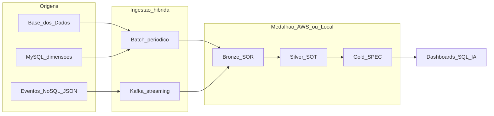
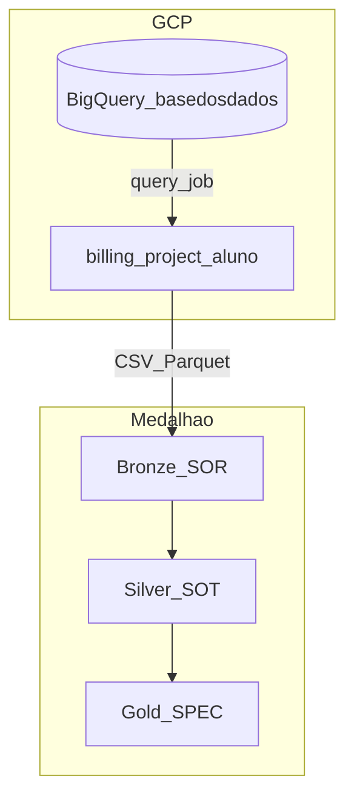

# Arquitetura da solução

## Visão geral

Pipeline **híbrida** (batch + streaming) em **arquitetura medalhão**, alinhada aos materiais da POSTECH Fase 2 e ao enunciado do Tech Challenge.



## Tecnologias e justificativa

| Camada | Tecnologia | Por quê |
|--------|------------|---------|
| Dev / demo medalhão | Python + Pandas + Parquet (local) e notebooks estilo Databricks | Mesmo fluxo `01→04` da aula de Arquitetura de Big Data; baixo custo |
| Cloud (enunciado) | **AWS** S3 (SOR/SOT/SPEC) + Glue | Padrão da aula `ETL Pipelines/03_Cloud` |
| Streaming | Kafka (ou file-sink equivalente) | Padrão `02_Kafka`; eventos de atualização de indicador |
| Origem relacional | MySQL | Disciplina de bancos relacionais; dims UF/município/metas |
| Eventos | JSON tipado (S/N) | Padrão NoSQL / DynamoDB Streams da aula Big Data |

## Camadas

### Bronze (raw / SOR)
- Dados brutos das entidades + eventos streaming  
- Metadados `_data_ingestao`, `_fonte`, `_modo`  
- Histórico por partição `dt=YYYY-MM-DD`  

### Silver (tratado / SOT)
- Tipagem, nulos, deduplicação, padronização de chaves  
- Integração indicador × meta × município → `indicador_meta_integrado`  

### Gold (analítico / SPEC)
1. `indicador_alfabetizacao_municipio`  
2. `comparativo_meta_resultado_uf` / `_brasil`  
3. `evolucao_temporal_*`  

## Trade-offs

| Tema | Decisão | Trade-off |
|------|---------|-----------|
| Batch vs streaming | Batch para históricos; streaming para microatualizações do indicador | Batch = barato e simples; streaming = frescor com mais ops |
| Data lake vs warehouse | Lake S3/Parquet + tabelas Gold analíticas | Lake flexível/custo baixo; warehouse (ex. Athena/BigQuery) melhora SQL ad-hoc |
| Custo vs performance | Glue/Databricks sob demanda + Parquet particionado | Menos idle cost; queries podem ser mais lentas que cluster sempre ligado |
| GCP vs AWS | **GCP BigQuery** para origem (Base dos Dados) + evidência real; **AWS Glue/S3** como caminho de deploy alinhado à aula ETL | GCP já paga o billing da consulta pública; AWS espelha SOR/SOT/SPEC da disciplina |

## Implementação em nuvem (Estágio 8)

### Caminho escolhido: GCP (evidência real) + template AWS (aula)



| Peça | Onde | Status |
|------|------|--------|
| Origem cloud | BigQuery `br_inep_avaliacao_alfabetizacao` | Executado — job ID em `reports/cloud_evidence/` |
| Billing | Projeto GCP `alfabetiza-fiap-t-challenge-2` | Ativo |
| Medalhão local | `data/bronze|silver|gold` Parquet | Produção didática |
| Deploy AWS (aula) | S3 SOR/SOT/SPEC + Glue template | `pipelines/batch/glue_jobs_template.py` + `infra/README.md` |

Reproduzir evidência:

```powershell
python -m pipelines.cloud.evidence_bigquery
```

Artefatos: `reports/cloud_evidence/EVIDENCIA_CLOUD.md` e `bigquery_job_evidence.json`.

## Monitoramento

Ver `docs/FINOPS_E_MONITORAMENTO.md` e `logs/pipeline_summary.json` (latência, volume, qualidade).

## Aplicação em IA (sobre a Gold)

A Gold está pronta para:

- **Predição** de % alfabetizados por município (features: meta, histórico, UF, volume avaliado)  
- **Análise de desigualdade** (gaps meta×resultado, clusters territoriais)  
- **Políticas baseadas em evidência** (priorização de municípios aquém da meta 2030)  
